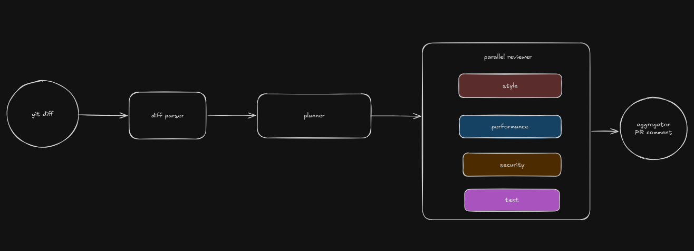

# Nexus — Multi-Agent Code Review Pipeline

Nexus reviews pull request diffs using parallel specialist agents, then runs every finding through a **critic agent** before producing a single PR comment. The core design goal isn't just "review code with LLMs" — it's catching LLM hallucination before it reaches a human reviewer.

## Architecture



Each reviewer is a single grounded LLM call — no tool use, no agent loop — since the diff content is already available. The planner and critic are the same shape: structured reasoning over data already in hand.

## Why a critic layer?

Specialist reviewer agents will confidently invent findings when given incomplete or malformed context. During development, reviewers repeatedly produced plausible-sounding but false claims, for example:

- Flagging a function as "untested" based only on seeing it imported — with no visibility into whether a test for it existed elsewhere
- Treating an environment-variable-based API key (the *correct*, secure pattern) as a potential hardcoded secret
- Inventing entire files and functions when the actual code content failed to reach the prompt

The critic agent independently re-checks every finding against the real added lines before anything reaches the final comment, and rejects claims it cannot directly verify — including claims that are differently worded but logically identical to ones it has already learned to catch.

## Setup

```bash
bun install
cp .env.example .env   # add your GROQ_API_KEY
bun run src/orchestrator.ts
```

By default the pipeline runs against a sample diff in `tests/`. Point it at a real diff with:

```bash
git diff main...your-branch > tests/your.diff
```

## What this project surfaces about building with LLMs

A few concrete lessons from building this, kept here because they generalize beyond this specific tool:

- **Empty or malformed prompt data doesn't fail loudly — it gets silently replaced with plausible-sounding fabrication.** Interpolating an array of objects directly into a template string (`${someArray}`) produces `"[object Object]"`, not the actual content, and the model will confidently review the empty slot anyway.
- **A diff only shows what changed, not the full file.** A reviewer checking "is this tested" needs the *whole* current file, not just the new lines — otherwise it constantly flags pre-existing, already-tested code as missing.
- **Fixing one phrasing of a bad claim doesn't generalize to other phrasings of the same logical error.** A critic rule that rejects "imported but not tested" can still let "imported but not used" through, even though both rest on the identical flawed premise. Guardrails need to target the *reasoning pattern*, not the wording.
- **Silence is a valid, often correct, output.** Reviewers prompted without an explicit instruction that an empty findings array is acceptable will manufacture a concern just to seem useful.

## Limitations
 
**Reviewers only see the diff, not the full file.** Every reviewer is shown the *added lines* from a `git diff`, not the complete current contents of the file. This is the main source of remaining false positives:
 
- A test-coverage check can't see tests that already exist in unchanged parts of a test file, so it sometimes flags pre-existing, already-tested functions as untested simply because their test isn't part of *this* diff
- A style or security reviewer has no view of surrounding code, so context-dependent issues (e.g. a variable that's actually used three functions down) can be missed or misjudged
The critic agent catches most of these as unverifiable claims, but it's a mitigation, not a fix. The correct fix is fetching full file contents (e.g. via the GitHub API's contents endpoint) for any file a reviewer needs broader context on, not just the diff hunk — planned as a v2 change.
 
**No deduplication across reviewers.** If two reviewers independently flag overlapping issues on the same line, both pass through to the aggregator, which currently relies on the synthesis prompt alone to merge them rather than an explicit dedup step.
 
**Single-model setup.** All agents currently run on the same model (Llama 3.3 70B via Groq). No evaluation has been done yet on whether a stronger model for the critic specifically (asymmetric model strength between generator and verifier) would meaningfully reduce the false-negative rate of missed hallucinations.
 
**No persistent eval suite.** Reviewer and critic prompts were validated against a small, manually-inspected set of test diffs during development, not a versioned regression suite. A prompt change today has no automated way to confirm it didn't reintroduce a previously-fixed failure mode.
 

## Stack

TypeScript, Bun, Groq (Llama 3.3 70B) — no agent framework, the orchestration loop is built from scratch.

